# Try And Choice
##  &nbsp; <strong>목차</strong>
---
1. 기획 의도
2. 주제선정 배경
3. 목표
4. 사용 스택
5. 기간
6. 역할
7. DB_ERD
8. 협업 준비 - 공유 Oracle, github(sourcetree)
9. Project Structure
10. 개발 일정
11. 동작 원리
12. 기능 소개
13. 오류 해결
---
##  &nbsp; <strong>기획 의도</strong>
### <b>새로운 소비 주체인 MZ세대를 타겟으로 잡아보자</b>
MZ세대의 특징
- 1980-2010년 사이의 출생자
- 개인의 취향과 경험 중시
- 타인의 소비경험에도 민감하게 반응
- 이전 세대에 비해 브랜드 충성도 낮음
- 미디어 플랫폼에 익숙
- '디지털 원주민'이라고도 불림

---

##  &nbsp; <strong>주제 선정 배경</strong>
### <b>BNK 부산은행의 부족한 점</b>
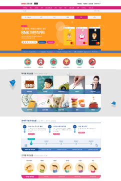\<!-- 경로 재지정 필요 -->
- 생애주기별, 고객별 추천 상품을 제안하고 있지만
- 개개인의 라이프 스타일이나 소비 패턴에 딱 맞는 추천은 제공하고 있지 않다

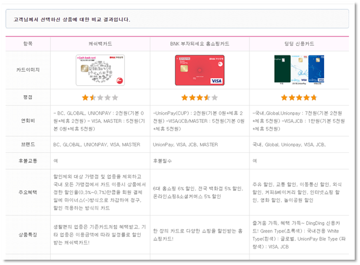
\\<!-- 경로 재지정 필요 -->
- 카드 비교 탭에서 볼 수 있는 화면
- 카드 비교가 가능하지만 텍스트 위주여서 한눈에 알아보긴 어렵다

### <b>타 서비스의 부족한 점</b>
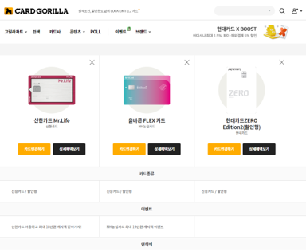
\\<!-- 경로 재지정 필요 -->
### CARD GORILLA (카드 고릴라)
- 카드 혜택 비교 사이트
- 카드 선호 순위를 중점으로 보여준다
- 카드 비교가 가능하지만 텍스트 위주

##  &nbsp;<strong>목표</strong>
### 직접 카드사용을 체험하고 이를 알기 쉽게 전달해 고객이 적절한 카드를 선택할 수 있게 하자!!

---
##  &nbsp; <strong>사용 스택</strong>

|분류|스택|버젼|
|---|---|---|
|Frontend|&nbsp;&nbsp;||
|backend||2.7.3|
||&nbsp;||
|DB|||
---
##  &nbsp; <strong>기간</strong>
2022-08-00 ~ 2022-08-28 
2022-08-29 ~ 2022-09-08

---
##  &nbsp; <strong>역할</strong>
|이름|역할|비고|
|---|---|---|
|송원준|조장|개발 환경 구축, 회원가입(소비등록) &, 마이페이지 구현, 카드간 할인, 비교 페이지 구현|
|류기탁|조원|소비패턴 분석, 패턴 비교 구현, 파일 업로드 구현, 인터셉터 구현, 영상 편집|
|박소연|조원|카드 할인 상세, 페이지 구현, 디자인 수정, 발표자료 작성|
|배은지|조원|로그인 페이지, 디자인 수정, 시연 영상 녹음|
|이화정|조원|관리자 페이지, 카테고리 관리 & 카드 관리 구현|

---
##  &nbsp; <strong>DB_ERD</strong>

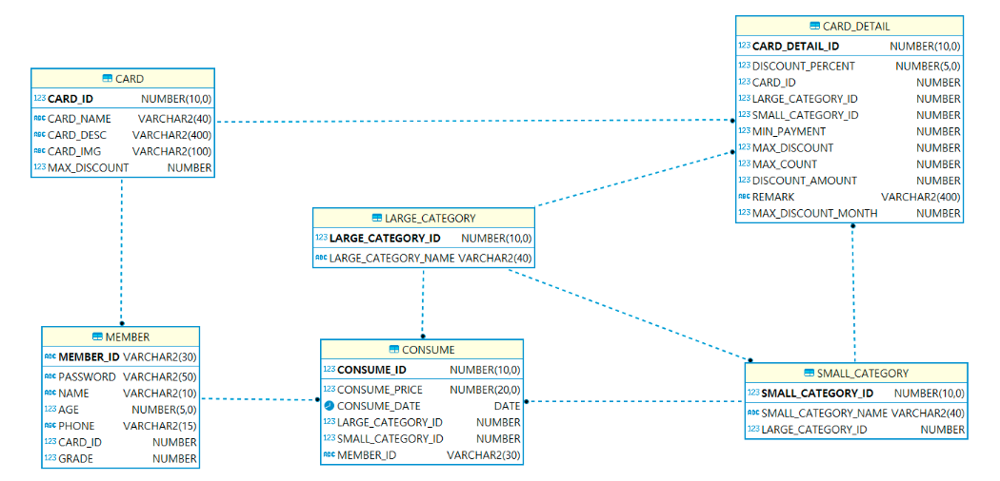
\\<!-- 경로 재지정 필요 -->
---

---
##  &nbsp; <strong>협업 준비 - 공유 Oracle, github(sourcetree)</strong>

---

##  &nbsp; <strong>Project Structure</strong>

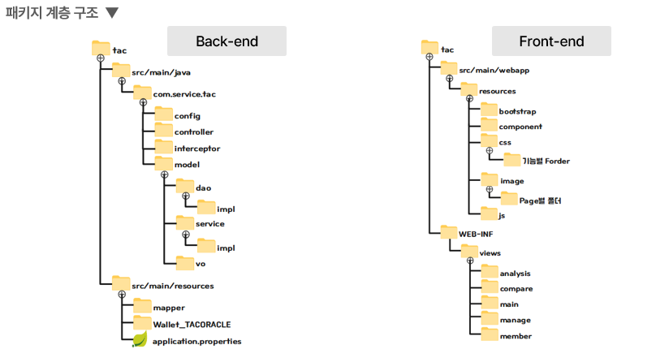
\\<!-- 경로 재지정 필요 -->

---

##  &nbsp; <strong>개발 일정</strong>

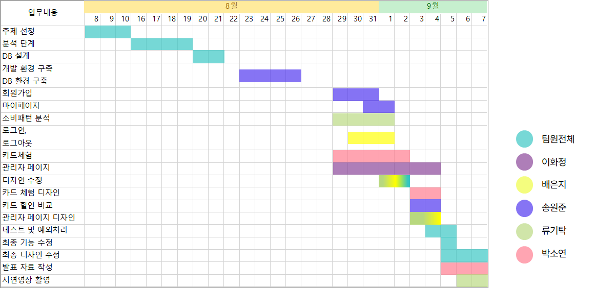
\\<!-- 경로 재지정 필요 -->

---

##  &nbsp; <strong>동작 원리</strong>

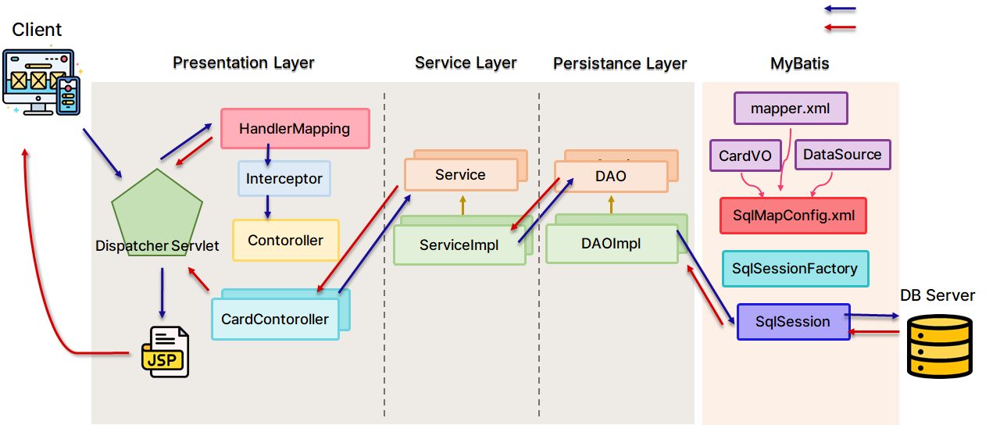
\\<!-- 경로 재지정 필요 -->

---

##  &nbsp; <strong>기능 소개</strong>
### <b>회원가입</b>
 
1. 개인 정보 등록

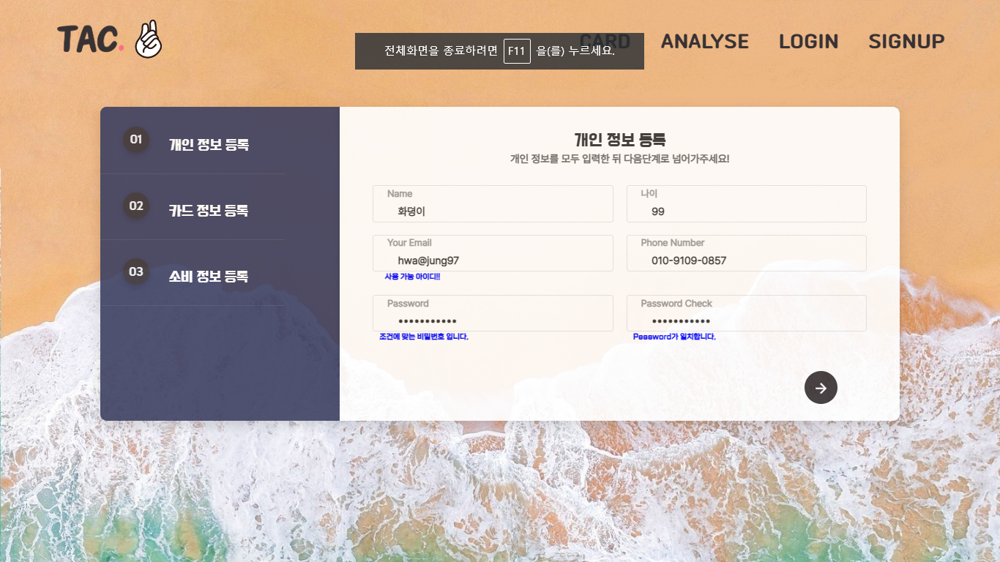
\\<!-- 경로 재지정 필요 -->

2. 카드 정보 등록
- 사용할 카드를 선택

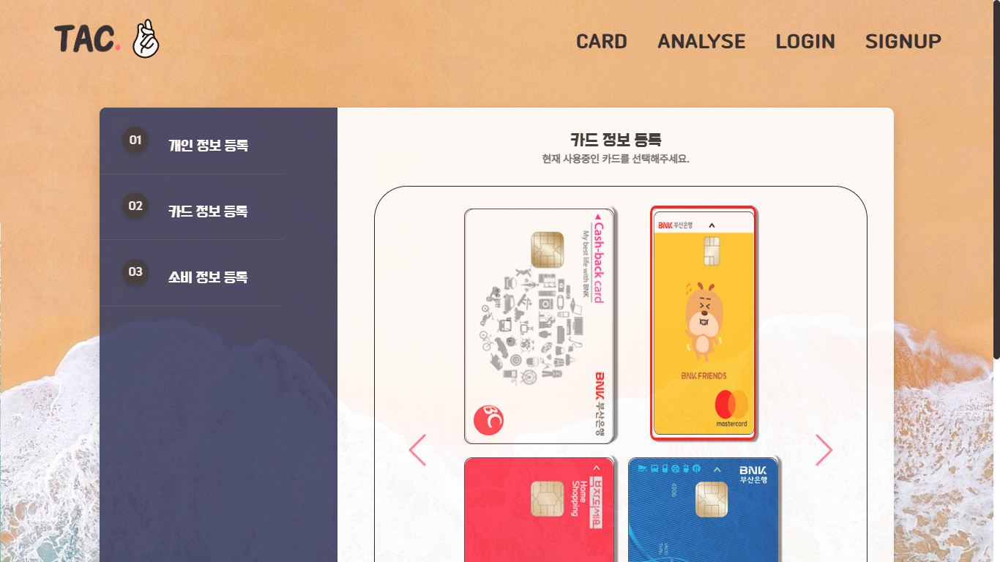
\\<!-- 경로 재지정 필요 -->

3. 회원 가입 완료 후 소비 정도 입력 창 클릭!

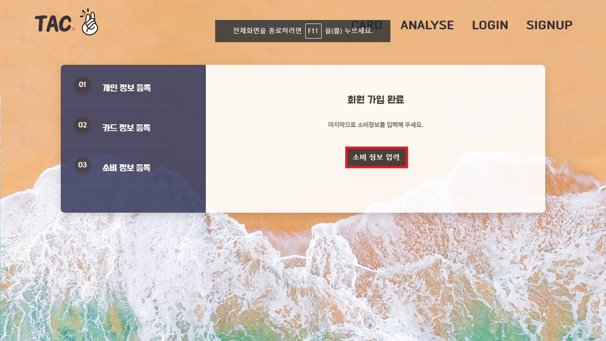
\\<!-- 경로 재지정 필요 -->

4. 달력에 소비 내역 자유롭게 입력 가능

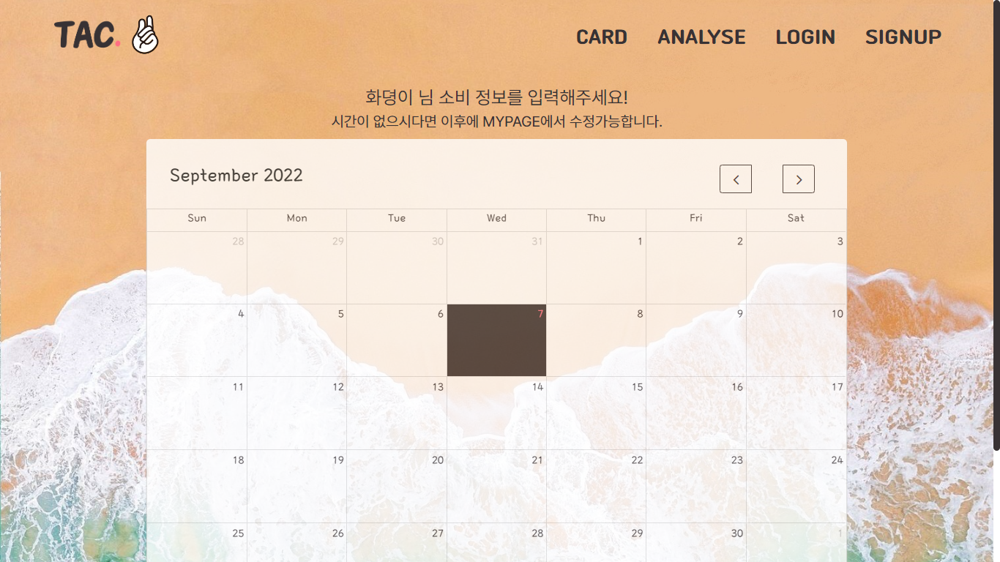
\\<!-- 경로 재지정 필요 -->

### <b>카드 비교</b>
 

CARD 클릭

\\<!-- 경로 재지정 필요 -->

1. 체험할 카드 선택하기
- 메인화면에서 체험해보고 싶은 카드 클릭

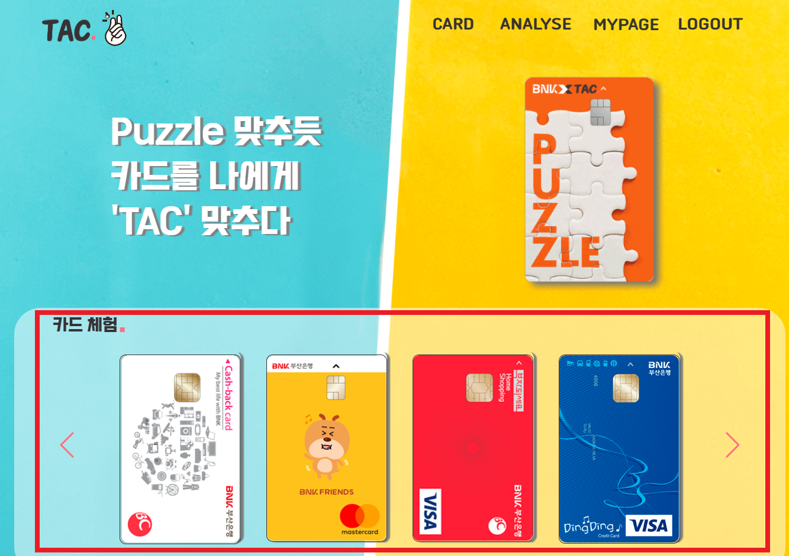
\\<!-- 경로 재지정 필요 -->

2. 선택한 카드 체험하기
- 체험해보고자 하는 카드의 정보와 본인의 소비 내역 간략히 소개

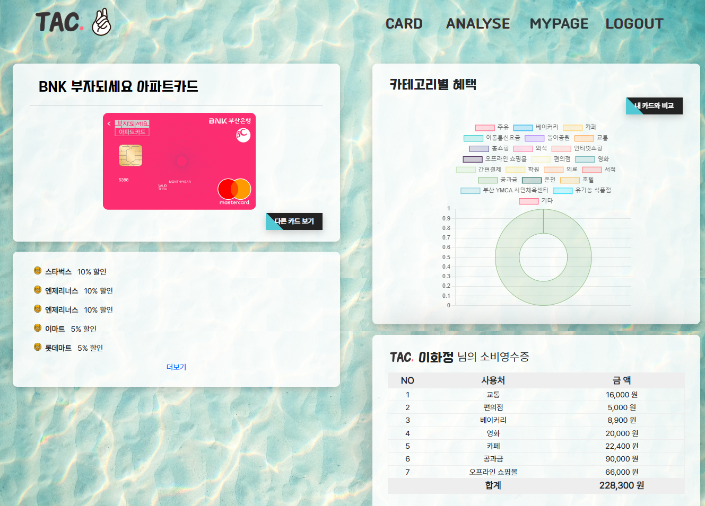
\\<!-- 경로 재지정 필요 -->

3. 선택한 카드와 내 카드 비교 체험하기
- 체험해보고자 하는 카드와 내가 사용중인 카드를 유형별로 비교하여 장 단점을 시각화하여 한눈에 알 수 있게끔 해준다.

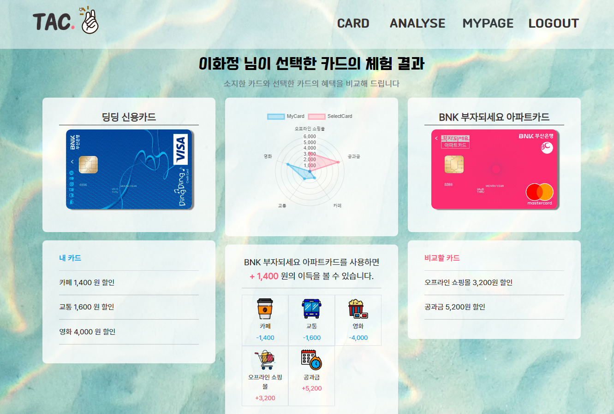
\\<!-- 경로 재지정 필요 -->

### <b>카드 비교</b>
 

ANALYSE 클릭

\\<!-- 경로 재지정 필요 -->

1. 유형별, 일별 분석 보기
- 본인의 소비 유형별 분석을 파이 차트로 보여주고,
일별 소비를 라인 차트로 보여준다. 

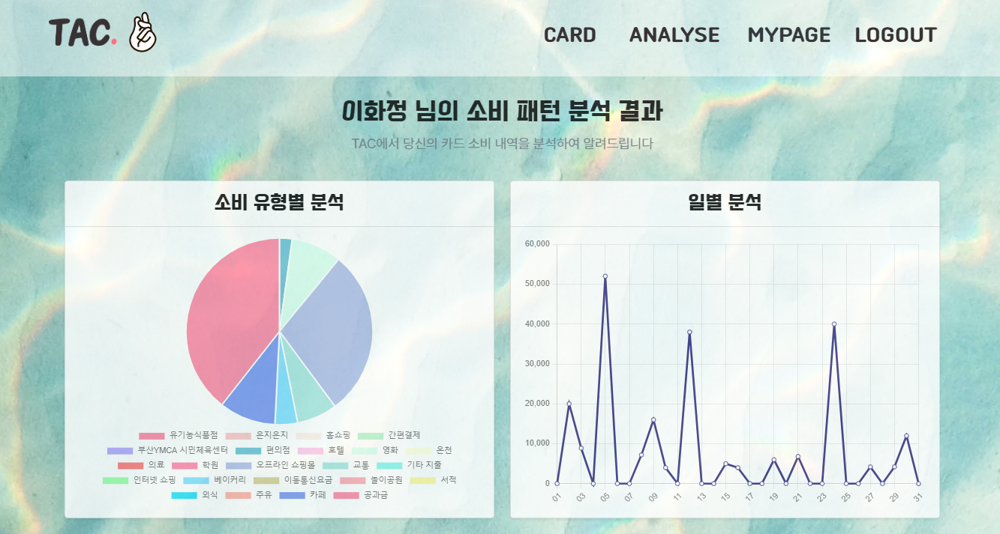
\\<!-- 경로 재지정 필요 -->

2. 동년배들과의 소비 유형 비교
- 왼쪽 소비 유형별 분석 클릭시 동년배들과의 소비 유형을 한눈에 알아 볼 수 있게 나타냈다.

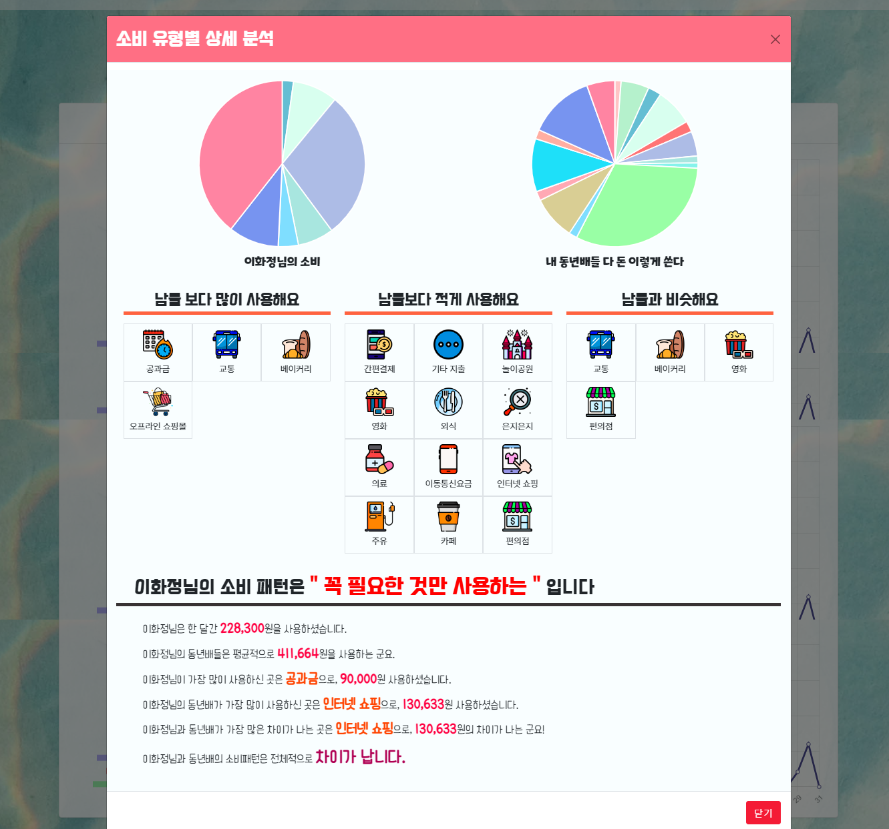
\\<!-- 경로 재지정 필요 -->

3. 동년배들과의 일별 소비 비교
- 오른쪽 일별 분석 클릭시 동년배들과 일별 소비를 비교하여 간단하게 나타내었다.

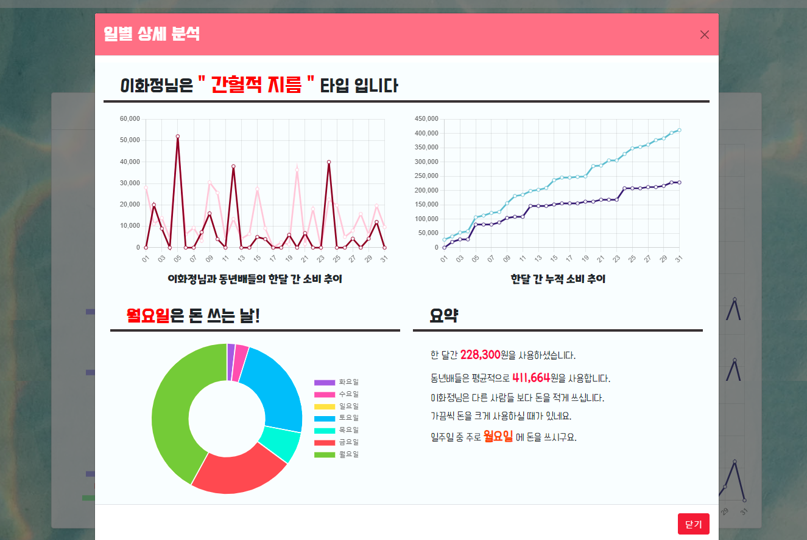
\\<!-- 경로 재지정 필요 -->

### <b>소비 수정</b>
 

MYPAGE 클릭

\\<!-- 경로 재지정 필요 -->

1. 캘린더 내에서 소비 내역 실시간 수정 가능

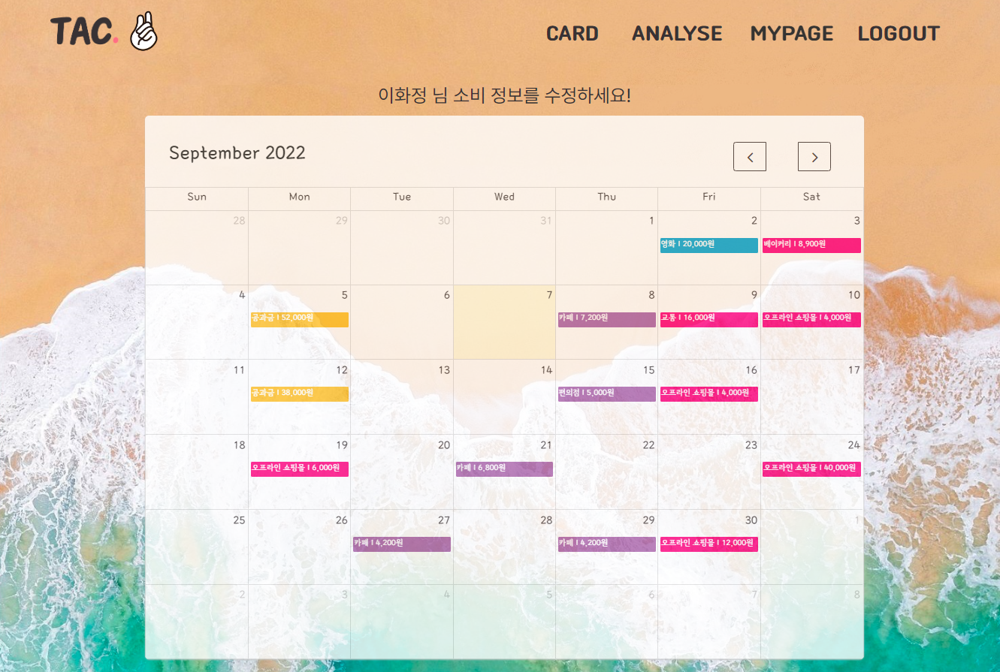
\\<!-- 경로 재지정 필요 -->
---

##  &nbsp; <strong>오류 해결</strong>
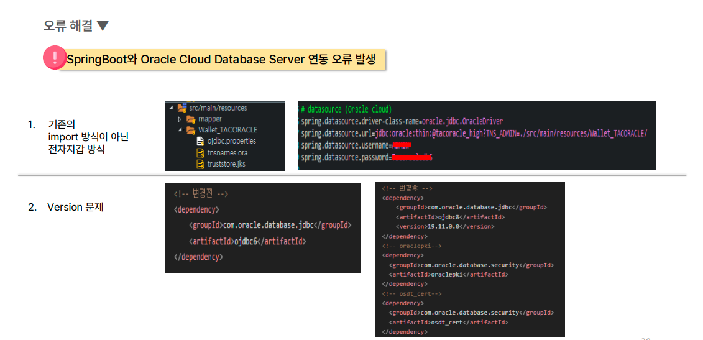
\\<!-- 경로 재지정 필요 -->

---